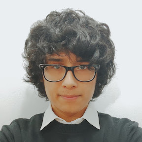
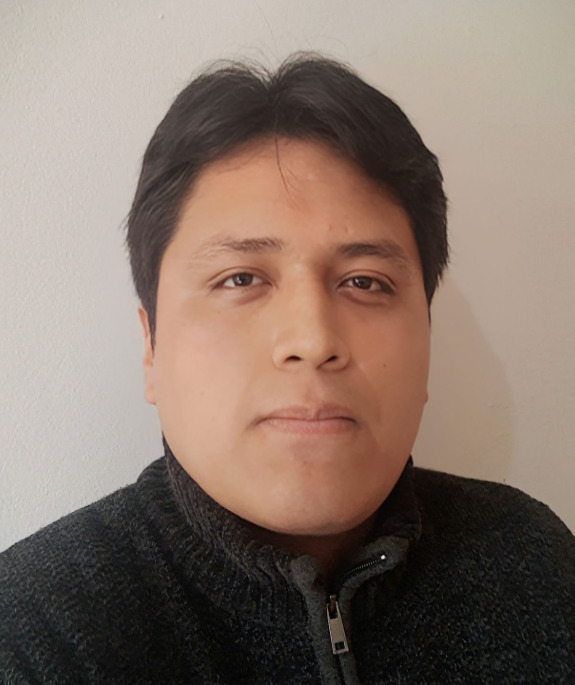

# 1.1. Startup Profile

En esta sección se presenta a Novatick, el equipo responsable del desarrollo de ANITEC, y se describen los conocimientos y habilidades que sus integrantes aportan al proyecto.

## 1.1.1. Descripción de la Startup

Novatick es una iniciativa emprendedora conformada por cinco estudiantes de la carrera de Ingeniería de Software de la Universidad Peruana de Ciencias Aplicadas. Su propósito es desarrollar soluciones digitales que faciliten la organización de información y apoyen la mejora de procesos mediante tecnologías móviles.

Como proyecto inicial, Novatick propone ANITEC, una aplicación móvil de gestión ganadera y apoyo veterinario dirigida a pequeños y medianos ganaderos y a veterinarios que atienden a este sector. La propuesta busca centralizar la información de los animales y facilitar la coordinación entre quienes se encagarn de su cuidado, promoviendo así la eficiencia y el bienestar animal.

ANITEC contempla el registro de animales, la cosnulta de historiales sanitarios, el registro de atenciones veterinarias y el seguimiento de cuidados pendientes.

## 1.1.2. Perfiles de integrantes del equipo

A continuación, se presentan los integrantes del equipo Novatick, junto con sus habilidades y conocimientos relevantes para el desarrollo de ANITEC:

| Integrante                                                                         | Perfil                                                                                                                                                                                                                                                                                                                        | Imagen                                                                                                 |
| ---------------------------------------------------------------------------------- | ----------------------------------------------------------------------------------------------------------------------------------------------------------------------------------------------------------------------------------------------------------------------------------------------------------------------------- | ------------------------------------------------------------------------------------------------------ |
| **Jorge Brayan Ayala Fernandez** U20241C030 Ingeniería de Software           | <Pendiente de completar por el integrante.>                                                                                                                                                                                                                                                                                   |        |
| **Johan Yonel León Morales** U20231H055 Ingeniería de Software               | Soy Johan Yonel León Morales, estudiante de quinto ciclo de Ingeniería de Software. Me caracterizo por mi responsabilidad, atención al detalle y capacidad para trabajar en equipo. Como líder del equipo, contribuiré a la planificación y coordinación de las actividades, así como al diseño de la arquitectura de ANITEC. |          |
| **Richard Enrique Lozano Leon** U20241D990 Ingeniería de Software            | <Pendiente de completar por el integrante.>                                                                                                                                                                                                                                                                                   |  |
| **Ghiou Justinn Mauricio Silva** U20241E242 Ingeniería de Software           | <Pendiente de completar por el integrante.>                                                                                                                                                                                                                                                                                   |  |
| **Edgar Alexander Mauricio Montes Zamora** U20241E126 Ingeniería de Software | <Pendiente de completar por el integrante.>                                                                                                                                                                                                                                                                                   |      |

